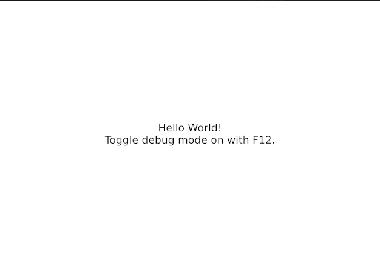

# Iced Hello World

> "Hello world" for the [iced](https://github.com/hecrj/iced) Rust UI framework

Helpful for demonstrating Iced to others! This is designed for testing on native platforms. WASM contributions welcome!

## Development

[Cargo watch](https://github.com/passcod/cargo-watch) can be installed (and/or updated) with this command:

`cargo install --force cargo-watch`

Then run in a sort of live-reload mode with this command:

`cargo watch -w src/*.rs -x run`

## Docs

For convenience, here are some links to the iced docs:

- <https://docs.rs/iced/>
- <https://docs.rs/iced_native/>
- <https://docs.rs/iced_web/>
